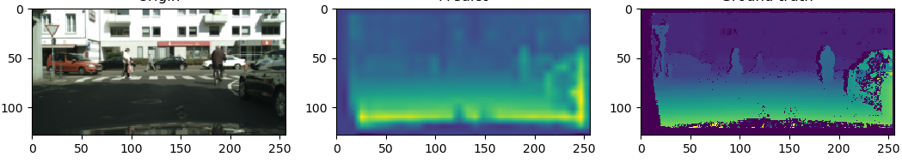

# Depth-Estimation

**Use PSPNet and Resnet to estimate depth in image for self-driving car without lidar**

# Requirements

$ pip install -r requirements.txt

# Data

Download dataset from [Kaggle](https://www.kaggle.com/datasets/sakshaymahna/cityscapes-depth-and-segmentation)

# Train

$ git clone https://github.com/hoangquocanhrb/Depth-Estimation

$ cd Depth-Estimation

$ python3 train.py --aux_weight=0.4 --batch_size=32 --num_epochs=1000

$ python3 predict.py --index=1

# Results

